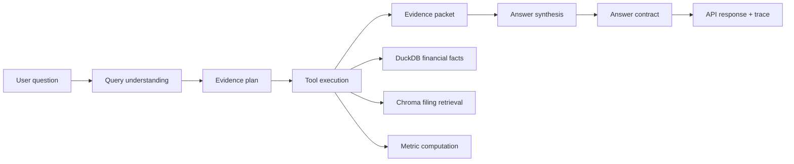

# FilingLens

FilingLens is an evidence-grounded financial filings analysis agent. It turns a natural-language company question into an explicit evidence plan, retrieves structured financial facts and SEC filing text, computes metrics with deterministic tools, and returns an answer with citations, limitations, and an inspectable trace.

This project is not investment advice. It is a local research and engineering demo for auditable financial analysis workflows.

## What It Does

- Resolves company mentions to supported public-company tickers.
- Classifies the question intent and builds an evidence plan before answering.
- Queries structured financial facts from DuckDB.
- Retrieves SEC filing text from a Chroma vector store.
- Computes financial metrics programmatically instead of asking the LLM to do arithmetic.
- Builds an evidence packet with numeric evidence, text evidence, computed metrics, citations, and caveats.
- Generates bounded answers through an OpenAI-compatible LLM endpoint.
- Serves a FastAPI backend, live frontend UI, and trace inspection endpoints.

## Architecture



The LLM helps with semantic interpretation and language generation. Final routing, evidence requirements, metric calculations, evidence sufficiency, citations, and safety boundaries are controlled by programmatic contracts.

## Repository Scope

This repository is intended to contain the runnable backend and the live API frontend:

- `src/`: agent workflow, API routes, tools, evidence models, rendering, and data access.
- `frontend/index.html`, `frontend/app.js`, `frontend/styles.css`: live API UI served by FastAPI.
- `scripts/`: setup, data loading, startup, and verification helpers.
- `tests/`: unit and regression tests that can run without private artifacts.
- `eval/`: benchmark definitions and evaluation runners, excluding generated reports.
- `data/companies.yaml` and `data/metric_mappings.yaml`: small tracked config files.
- `docs/`: public architecture, data, and evaluation notes.

This repository intentionally excludes preset-answer demo pages and curated demo-case datasets. It also excludes private maintenance archives, generated eval reports, local traces, downloaded filings, DuckDB databases, Chroma vector stores, logs, and real `.env` files.

## Quick Start

Create a virtual environment and install the package:

```bash
python -m venv .venv
source .venv/bin/activate
pip install -e .[dev]
```

Copy an environment template:

```bash
cp .env.example .env
```

Do not commit `.env` or API keys.

## Run With An OpenAI-Compatible API

This is the easiest way to run the API and frontend without hosting a local model.

```bash
cp .env.siliconflow.example .env.siliconflow
```

Edit `.env.siliconflow` and set your API key and model names. Then start the stack:

```bash
LLM_PROFILE=siliconflow bash scripts/start_full_stack.sh
```

Open:

```text
http://127.0.0.1:8080/ui/
```

API docs are available at:

```text
http://127.0.0.1:8080/docs
```

If port `8080` is already in use:

```bash
API_PORT=8090 LLM_PROFILE=siliconflow bash scripts/start_full_stack.sh
```

## Run With Local vLLM

For a fully local model endpoint, configure `.env` for your local OpenAI-compatible vLLM server and run:

```bash
bash scripts/start_local_stack.sh
```

The launcher expects a local model endpoint compatible with OpenAI Chat Completions. GPU memory, model availability, and local cache setup are environment-specific.

## Data Setup

The app can start without a fully populated local data store, but useful analysis depends on local financial facts and filing retrieval assets.

Configure SEC EDGAR identity in `.env`:

```text
SEC_EDGAR_COMPANY_NAME=YourName
SEC_EDGAR_EMAIL=your-email@example.com
```

Common data-building scripts include:

```bash
.venv/bin/python scripts/download_filings.py
.venv/bin/python scripts/parse_filings.py
.venv/bin/python scripts/chunk_filings.py
.venv/bin/python scripts/load_sec_companyfacts.py
.venv/bin/python scripts/build_vectorstore.py
```

Runtime data should stay local:

- `data/raw/`
- `data/processed/`
- `data/chunks/`
- `data/db/`
- `data/vectorstore/`
- `data/traces/`
- `logs/`

## API Endpoints

- `GET /health`: health check.
- `POST /chat`: run an analysis request.
- `GET /trace/{trace_id}`: inspect a saved trace bundle.
- `GET /ui/`: live frontend UI.
- `GET /docs`: FastAPI OpenAPI docs.

Example request:

```bash
curl -X POST http://127.0.0.1:8080/chat \
  -H "Content-Type: application/json" \
  -d '{"query": "Analyze NVIDIA revenue growth drivers and key risks."}'
```

## Checks

```bash
make lint
make test
make data-status
```

Some integration and evaluation paths require a populated DuckDB database, Chroma vector store, embedding model cache, FastAPI server, or LLM endpoint. Default tests are designed to skip external-service cases when those assets are unavailable.

## Frontend

The public frontend is the live API UI:

```text
http://127.0.0.1:8080/ui/
```

It sends user questions to the running FastAPI backend and renders the answer, evidence matrix, limitations, telemetry, and trace information.

## Limitations

- Output quality depends on the available filings corpus, structured financial facts, retrieval index, and model endpoint.
- The system is designed for evidence-grounded analysis, not investment recommendations.
- Missing or partial evidence should appear as visible caveats instead of unsupported claims.
- Local performance depends on model size, GPU/CPU resources, vector store size, and retrieval configuration.

## License

A license has not been selected yet. Add a `LICENSE` file before announcing the repository as an open-source release or accepting external reuse.
