# Architecture

This project is an evidence-grounded financial filings analyst. The core design goal is to make the agent auditable: the LLM may propose semantic understanding and draft bounded text, but final routing, evidence requirements, financial calculations, DimensionStatus, and answer validation are explicit programmatic contracts.

## End-To-End Flow

```mermaid
flowchart LR
    Q[Raw user query] --> LSP[LLM Semantic Parser]
    Q --> PV[Program Validator]
    LSP --> PV
    PV --> ER[Entity resolution]
    PV --> IC[Methodology intent validation]
    ER --> QU[QueryUnderstanding]
    IC --> QU
    QU --> CI[CanonicalIntent]
    CI --> QP[QueryPlan compatibility layer]
    QP --> FW[Analysis framework selection]
    FW --> POL[EvidencePolicy]
    POL --> EP[EvidencePlan]
    EP --> EX[Tool execution]
    EX --> RAG[SEC filing RAG]
    EX --> FACTS[DuckDB financial facts]
    EX --> CALC[Programmatic calculations]
    RAG --> PKT[EvidencePacket]
    FACTS --> PKT
    CALC --> PKT
    PKT --> DSM[DimensionStatusMap]
    DSM --> SYN[Synthesis + renderer]
    SYN --> OUT[Answer, output view, trace]
    OUT -. post-hoc eval / CLI .-> AC[Answer evidence contract]
```



## QueryUnderstanding Layer

`QueryUnderstanding` is the single semantic entrypoint. It contains:

- normalized query
- resolved companies and unresolved mentions
- analysis scope: single company, comparison, meta, unsupported, or unknown
- methodology intent: overview, risk, cash flow, profitability, revenue, balance sheet, valuation, comparison, or none
- user expectation: quick answer, deep analysis, recommendation-like, diagnostic, or clarification
- safety intent: normal, advice-like, prediction, or unsupported
- time scope and default period policy
- confidence and clarification state

The legacy `QueryPlan` shape is retained for compatibility, but it is derived from `QueryUnderstanding`.

## CanonicalIntent

`CanonicalIntent` is the stable intent contract between query understanding and planning. It exists to prevent paraphrases of the same question from drifting into different `answer_mode`, dimension, or evidence-plan branches.

It normalizes:

- intent family such as risk, cash flow, valuation, profitability, revenue, balance sheet, overview, comparison, or refusal
- analysis scope
- resolved companies
- requested dimensions
- time focus
- user expectation
- safety intent
- confidence and source signals

The LLM semantic proposal and deterministic rules both feed this contract. Program logic merges the signals, applies safety overrides, validates dimensions and companies, then writes the resulting `canonical_intent` into trace/API output. Downstream code should consume this structured contract instead of reinterpreting raw query wording.

## Entity Resolution vs Intent Classification

Entity resolution and intent classification are deliberately separated.

Entity resolution answers only:

```text
Who is the user asking about?
```

It supports tickers, English company names, Chinese aliases, common typos such as `nvidai`, and multi-company order. It does not know about risk, valuation, cash flow, or advice-like requests.

Methodology intent classification answers only:

```text
What kind of analysis does the user want?
```

This prevents company matching from accumulating scattered business logic and keeps future classifier upgrades contained.

## LLM Semantic Proposal, Program Final Authority

The live classifier uses the existing LLM call to produce a structured `QueryUnderstandingProposal`. The proposal can include company mentions, methodology intent, requested dimensions, user expectation, safety signals, time scope, confidence, and reasons.

Program logic owns final authority:

- company output is accepted only after `resolve_companies`
- methodology intent must be an allowed enum
- requested dimensions must be supported analysis dimensions
- direct factual metric questions stay direct facts
- prediction, unsupported, and advice-like safety boundaries are enforced conservatively
- invalid labels, low confidence, malformed schemas, or unsupported dimensions are recorded and fall back to deterministic routing

This lets the LLM handle ambiguous natural-language semantics while deterministic code owns execution authority, auditability, tool selection, EvidencePlan construction, and answer constraints.

## EvidencePolicy, EvidencePlan, And Tool Execution

`EvidencePolicy` is the contract between canonical intent and evidence planning. It centralizes what each intent needs rather than scattering required/optional evidence decisions across planner branches.

Each requirement has a `requirement_scope`:

- `core`: required to answer the user's core question
- `optional_context`: helpful context that can improve the answer but must not block publication when core evidence is available
- `diagnostic`: supplemental calculations or debug/eval context

Policy examples:

- overview -> business, revenue, profitability, cash flow, balance sheet, risk, valuation boundary
- risk -> core risk-factor text; business model, MDA, revenue, net income, and margin trend as optional context
- cash flow -> operating cash flow, free cash flow, cash conversion
- valuation -> price, market cap, multiples, and explicit boundary language
- comparison -> symmetric revenue, profitability, risk, and valuation-boundary requirements

`EvidencePlan` consumes the policy and produces concrete tool requirements. It may still use raw query text to build retrieval phrases, but raw query wording should not decide business intent or requirement criticality.

Tool execution uses:

- SEC filing RAG for business and risk text evidence
- DuckDB for structured financial facts and price history
- pure calculation utilities for margins, leverage ratios, cash conversion, market cap, P/E, P/S, and FCF yield

LLMs do not compute financial metrics.

## EvidencePacket

`EvidencePacket` is the bridge between retrieval/execution and synthesis. It carries:

- validated numeric evidence
- validated text evidence
- display labels and formatted values
- citations such as `[N1]` and `[T1]`
- source provider, confidence, and extraction method
- computed metric dependencies
- reconciliation warnings
- allowed and forbidden claims
- dimension summaries and evidence refs

The packet is intended to make the final answer auditable without reading raw tool logs.

## DimensionStatusMap

`DimensionStatusMap` is the shared fact source for trace, answer, and UI.

Each dimension records:

- status: `satisfied`, `partial`, or `missing`
- required and enhanced metrics available/missing
- supporting evidence ids
- limitations and caveats

Synthesis must obey the map:

- a missing dimension cannot produce a positive analytical conclusion
- a partial dimension must use bounded wording
- a satisfied dimension can support analysis only with evidence refs

This prevents contradictions such as trace saying a dimension is satisfied while the answer claims there is no evidence.

## Sufficiency And Requirement Scope

Sufficiency now evaluates core requirements separately from optional context and diagnostics.

For example, `risk_focused_analysis` uses policy `single_company_risk_v1`. The core requirement is company-specific risk text, typically `ITEM_1A`. Business-model context, MDA, revenue, net income, and margin trend can strengthen the answer but missing them only creates warnings or limitations. They do not force repair or blocking when core risk evidence is satisfied.

Composite questions are different. If the user explicitly asks for multiple dimensions, such as cash flow quality, valuation boundary, and main risks, those requested dimensions remain core requirements. The policy must not collapse them into a generic overview or treat one requested dimension as optional.

## SEC/yfinance Reconciliation

Structured facts prefer SEC Companyfacts. yfinance is stored and exposed as a medium-confidence fallback, not disguised as SEC data.

The reconciliation report compares SEC and yfinance values by ticker, period, and metric. Large differences create warnings that can appear in trace and answer boundaries. This is important because SEC and yfinance may disagree due to period basis, unit interpretation, cumulative-versus-quarterly values, or provider conventions.

Coverage and reconciliation reports:

- Latest archived snapshots: `docs/archive/data_reports/methodology_data_coverage_diff.md`
- Latest archived snapshots: `docs/archive/data_reports/financial_fact_reconciliation.md`
- Fresh generated reports are written under ignored `data/reports/`.

## Metric Semantics

Financial display semantics live in `metric_display.py`. The renderer does not treat every ratio as a percentage.

Examples:

- market cap -> `$4.31T`
- net debt -> `$0.44B`
- P/E -> `100.36x`
- P/S -> `63.29x`
- FCF yield -> `0.81%`
- debt/equity -> `7.02%`

Raw values remain available in trace/debug fields.

## Answer Evidence Contract

The answer contract checker validates the rendered answer against the evidence packet and trace. It now has two surfaces: a runtime guard in the live graph after answer generation, and a backward-compatible post-hoc eval / CLI checker for completed traces.

Runtime decisions are exposed as:

- `contract_decision`: `blocked`, `repairable`, `warning`, or `passed`
- `draft_release_decision`: whether the analyst draft was released, released with warnings, repaired, blocked, or replaced by deterministic fallback

Optional context gaps are warnings. Hard blockers remain hard blockers: invented numbers, invalid citations, wrong-company evidence, direct buy/sell advice, target prices, and unsupported deterministic predictions.

It checks:

- numeric grounding
- citation validity
- DimensionStatus compliance
- forbidden valuation/advice claims
- caveat visibility
- comparison evidence balance
- raw internal-code leakage

The checker is available as a library in `src/agent/answer_contract.py`, a CLI in `scripts/check_answer_evidence_contract.py`, an answer-mode eval gate in `eval/run_methodology_eval.py`, and the live LangGraph guard. The live `/chat` endpoint returns only the finalized answer after contract pass, repair, evidence retry, or safe blocking.

## Trace And Debug Observability

Traces and the browser audit view expose the intent-contract path:

- `canonical_intent`
- `evidence_policy_id`
- requirement scope grouping and counts
- `contract_decision`
- `draft_release_decision`
- fallback behavior such as `lexical_first`, `fallback_after_timeout`, and `fallback_after_error`

The debug bundle deduplicates repeated tool calls by preferring successful fallback results, so a requirement ledger does not show an obsolete zero-result call when a later fallback returned usable evidence.

## Architecture Hardening Summary

The architecture review and hardening work is tracked in `docs/reviews/`. The completed Phase 7 changes were intentionally small and contract-focused:

- `make eval-planning` is now the local/CI gate for planning-only methodology eval, covering QueryUnderstanding, intent routing, framework selection, dimension activation, and EvidencePlan planning.
- `DimensionStatusMap` has an explicit canonical/alias policy: `dimension_status_by_id` is canonical, `dimension_status_map` is a compatibility alias, and `covered_dimensions` remains an alias for `satisfied_dimensions`.
- `EvidencePlanner` no longer uses raw query keyword checks for text requirement intent; it consumes structured methodology intent, scope, active dimensions, and intent reasons while keeping raw query text for retrieval phrase construction.
- `QueryPlan` is structured-first for company, methodology intent, analysis scope, safety intent, and answer mode derivation, with legacy fallback paths retained for compatibility.
- `AnswerContract` is documented and tested as both a runtime guard and a post-hoc eval/CLI/release checker.
- `CanonicalIntent` and `EvidencePolicy` now stabilize paraphrased questions and separate core evidence from optional context, reducing one-off query wording patches.

Deferred hardening scope remains explicit: larger `query_plan.py` decomposition, retrieval policy raw query parsing cleanup, streaming trace events, answer-depth improvements, and data coverage / reconciliation threshold CI gates.

## Why Not A Free-Form RAG Answer?

Free-form RAG can produce fluent answers, but this project needs evidence and method boundaries:

- financial numbers must come from tools or computed evidence
- calculations must be reproducible
- missing evidence must limit claims
- citations must resolve to packet evidence
- safety boundaries must block buy/sell calls, target prices, DCF claims, and unsupported forecasts
- trace and answer must agree

The result is less flexible than unconstrained generation, but much easier to inspect, test, and discuss as an engineering system.
